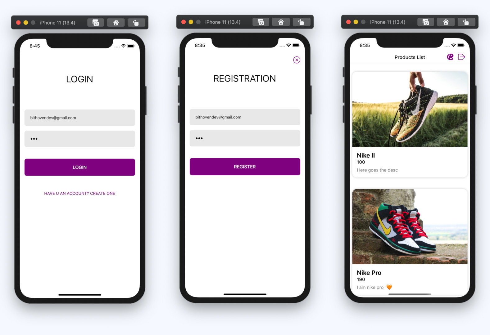
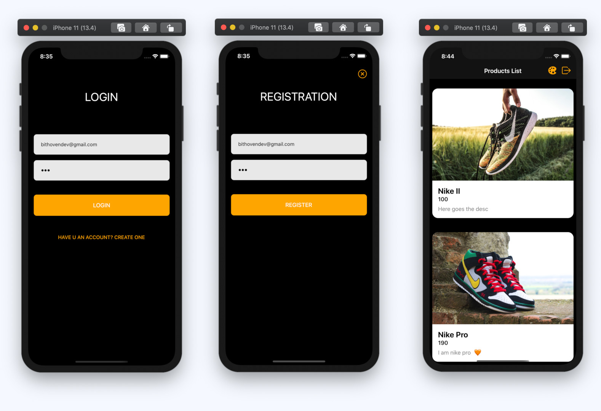

# ReactNavigationAuthenticationFlowsWithHooks

## Light theme:


## Dark theme:


This repo is the source code for a youtube series about how to create a react native authentication system using React Navigation 5 and hooks.

It contains registration, login, persisting user to secure local storage and theming.

For the backend, the app is using Strapi.io, a headless CMS, the same as the one we used in this project:
[ReactNativeApolloOnlineStore](https://github.com/bithoven-dev/ReactNativeApolloOnlineStore)

## How to run the project:

# Backend:

Go inside the server folder and run:

```
yarn develop
```

# Mobile:

Got inside the client folder.
Start the metro bundler:

```
yarn start
```

For android:

```
yarn android
```

For iOS:
```
yarn ios
```

PS: make sure that you have installed all the required dependencies including running pod installs.

# Videos

[Login + Registration layout / Authentication Flows](https://youtu.be/rHJTv3KlZW8)
